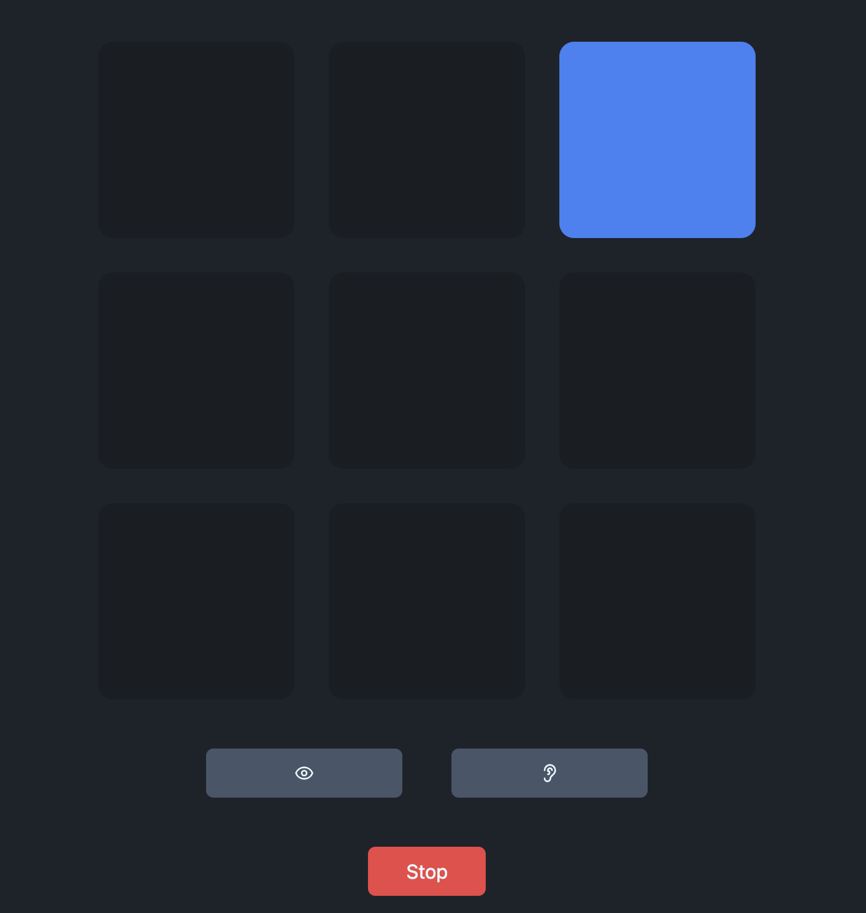

# Dual n-Back

Dual n-back is a cognitive training exercise designed to improve working memory and fluid intelligence. There are other versions online but I decided to make my own because they are either dated, or certain features are paywalled. This implementation is not perfect, but I felt like making it. So enjoy.

## Example

## Instructions

1. **Choose your level**
  Pick an **n** value (how many steps back you compare against). Higher **n** is harder. Use **Settings** → **Apply** to save.
2. **Start a round**
  Press **Play**. Each round has **20** turns. On every turn you will see **one tile** light up in the 3×3 grid and hear **one spoken letter** (from A, E, H, K, L, O)

